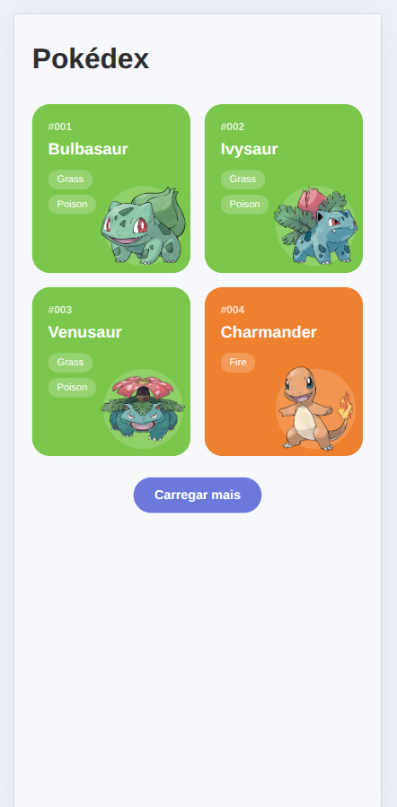

# Pokédex — JavaScript + PokéAPI

### Projeto Front-end | JavaScript Developer — DIO

Pokédex responsiva desenvolvida com **HTML, CSS e JavaScript puro**, consumindo dados públicos da **PokéAPI**.

O projeto faz parte dos meus estudos na formação **JavaScript Developer da DIO** e tem como objetivo consolidar conceitos fundamentais de JavaScript aplicados a uma aplicação real, incluindo consumo de API, Promises, transformação de dados, manipulação do DOM, renderização dinâmica e paginação.

---

## Demonstração



---

## Sobre o projeto

A aplicação apresenta uma Pokédex dinâmica construída a partir dos dados disponibilizados pela PokéAPI.

Os Pokémon não são inseridos manualmente no HTML. A interface consulta a API, transforma os dados recebidos e gera os cards dinamicamente no navegador.

Cada card apresenta:

- número do Pokémon;
- nome;
- tipo principal;
- tipos adicionais;
- artwork oficial;
- cor baseada no tipo principal.

A aplicação também possui carregamento incremental por meio do botão **Carregar mais**, permitindo adicionar novos Pokémon à listagem sem recarregar a página.

---

## Funcionalidades implementadas

- consumo da PokéAPI com `fetch`;
- validação das respostas HTTP;
- transformação dos dados retornados pela API;
- renderização dinâmica de Pokémon;
- exibição de número, nome e tipos;
- utilização do artwork oficial disponibilizado pela PokéAPI;
- fallback para sprite quando necessário;
- identificação visual dos Pokémon pelo tipo principal;
- suporte de cores para diferentes tipos;
- carregamento incremental;
- paginação utilizando `offset` e `limit`;
- carregamento simultâneo de detalhes com `Promise.all`;
- controle do estado do botão durante as requisições;
- manipulação dinâmica do DOM;
- layout responsivo;
- organização dos cards com CSS Grid.

---

## Integração com a PokéAPI

A aplicação utiliza a PokéAPI como fonte pública de dados.

Endpoint principal de listagem:

```text
https://pokeapi.co/api/v2/pokemon
```

A consulta utiliza os parâmetros:

```text
offset
limit
```

para controlar o carregamento incremental dos registros.

Exemplo conceitual:

```text
https://pokeapi.co/api/v2/pokemon?offset=0&limit=4
```

A primeira resposta fornece uma lista contendo o nome e a URL individual de cada Pokémon.

A aplicação utiliza essas URLs para buscar os dados completos de cada item.

O fluxo pode ser representado da seguinte forma:

```text
PokéAPI
   ↓
Lista de Pokémon
   ↓
URLs individuais
   ↓
Detalhes dos Pokémon
   ↓
Transformação dos dados
   ↓
Modelo utilizado pela aplicação
   ↓
Renderização dos cards
```

As requisições de detalhes são agrupadas com:

```javascript
Promise.all(...)
```

permitindo aguardar todas as consultas antes de renderizar o conjunto solicitado.

---

## Transformação dos dados

Os objetos retornados pela PokéAPI possuem diversas propriedades que não são necessárias para a interface.

Por isso, a aplicação transforma a resposta da API em um modelo menor contendo somente os dados utilizados na Pokédex.

Exemplo conceitual:

```javascript
{
  number: "001",
  name: "bulbasaur",
  types: ["grass", "poison"],
  photo: "..."
}
```

Essa etapa ajuda a separar:

```text
estrutura da API
      ↓
dados necessários
      ↓
estrutura utilizada pela interface
```

---

## Carregamento incremental

A aplicação utiliza duas variáveis principais para controlar a paginação:

```javascript
offset;
limit;
```

O `limit` determina quantos Pokémon são carregados por requisição.

O `offset` determina a partir de qual posição a próxima consulta será realizada.

Fluxo simplificado:

```text
offset = 0
limit = 4
     ↓
#001 até #004
     ↓
Carregar mais
     ↓
offset = 4
     ↓
#005 até #008
     ↓
Carregar mais
     ↓
offset = 8
     ↓
#009 até #012
```

Os novos Pokémon são adicionados ao final da listagem existente.

---

## Identificação visual por tipo

A cor de cada card é definida de acordo com o primeiro tipo retornado pela PokéAPI.

Exemplos:

```text
Grass    → verde
Fire     → laranja
Water    → azul
Electric → amarelo
Bug      → verde-amarelado
```

A aplicação possui estilos para os principais tipos existentes no universo Pokémon, incluindo:

- normal;
- fire;
- water;
- electric;
- grass;
- ice;
- fighting;
- poison;
- ground;
- flying;
- psychic;
- bug;
- rock;
- ghost;
- dragon;
- dark;
- steel;
- fairy.

Também existe uma cor padrão de fallback para preservar a legibilidade caso um tipo não esteja mapeado.

---

## Imagens dos Pokémon

A aplicação prioriza o **Official Artwork** fornecido pela PokéAPI.

Quando disponível, é utilizado:

```text
sprites.other["official-artwork"].front_default
```

Caso o artwork não esteja disponível, a aplicação utiliza como fallback:

```text
sprites.front_default
```

Esse comportamento evita que um Pokémon deixe de apresentar imagem quando uma das fontes não estiver disponível.

---

## Tecnologias utilizadas

| Tecnologia | Aplicação                        |
| ---------- | -------------------------------- |
| HTML5      | Estrutura da interface           |
| CSS3       | Estilização e responsividade     |
| JavaScript | Lógica da aplicação              |
| Fetch API  | Comunicação HTTP                 |
| PokéAPI    | Fonte pública de dados           |
| CSS Grid   | Organização dos cards            |
| Promises   | Fluxo assíncrono das requisições |

O projeto foi desenvolvido **sem frameworks JavaScript**.

---

## Estrutura do projeto

```text
dio-js-pokedex/
│
├── src/
│   ├── css/
│   │   └── style.css
│   │
│   ├── js/
│   │   └── main.js
│   │
│   └── index.html
│
├── .gitignore
└── README.md
```

A estrutura foi mantida simples e proporcional ao tamanho atual da aplicação.

---

## Executando o projeto

Clone o repositório:

```bash
git clone https://github.com/diegodemelo/dio-js-pokedex.git
```

Entre no diretório:

```bash
cd dio-js-pokedex
```

A aplicação é composta por arquivos estáticos.

Abra:

```text
src/index.html
```

em um navegador.

Também é possível executar o projeto utilizando uma extensão como **Live Server** no Visual Studio Code.

> A aplicação precisa de acesso à internet para consultar a PokéAPI e carregar os artworks dos Pokémon.

---

## Conceitos praticados

Durante o desenvolvimento estão sendo praticados conceitos como:

- `const` e `let`;
- funções;
- objetos;
- arrays;
- `map`;
- `join`;
- template literals;
- Promises;
- `fetch`;
- `Promise.all`;
- tratamento de erros;
- respostas HTTP;
- JSON;
- manipulação do DOM;
- eventos;
- geração dinâmica de HTML;
- `insertAdjacentHTML`;
- paginação;
- `offset`;
- `limit`;
- fallback de dados;
- CSS Grid;
- media queries;
- responsividade;
- integração com API REST;
- Git;
- GitHub.

---

## Fluxo da aplicação

Um dos principais aprendizados do projeto é acompanhar todo o caminho percorrido pelos dados.

```text
Requisição HTTP
      ↓
PokéAPI
      ↓
Resposta JSON
      ↓
Transformação dos dados
      ↓
Modelo da aplicação
      ↓
Geração do HTML
      ↓
Manipulação do DOM
      ↓
Interface
```

Esse fluxo demonstra como dados externos podem ser transformados em componentes visuais utilizando apenas recursos nativos do navegador.

---

## Aprendizados

O desenvolvimento desta Pokédex permite consolidar conceitos fundamentais do desenvolvimento Front-end com JavaScript.

Entre os principais aprendizados estão:

- consumir uma API REST;
- trabalhar com operações assíncronas;
- utilizar Promises;
- interpretar respostas JSON;
- transformar estruturas externas em modelos próprios;
- criar elementos dinamicamente;
- atualizar a interface sem recarregar a página;
- implementar carregamento incremental;
- utilizar dados da API para definir elementos visuais;
- organizar uma interface responsiva;
- diagnosticar erros utilizando o DevTools;
- evoluir uma funcionalidade em pequenos checkpoints;
- utilizar Git e GitHub para versionamento do projeto.

---

## Evolução do projeto

O desenvolvimento foi realizado de forma incremental.

```text
Interface estática
      ↓
Primeira requisição à PokéAPI
      ↓
Transformação dos dados
      ↓
Primeiro Pokémon dinâmico
      ↓
Múltiplos Pokémon
      ↓
Endpoint de listagem
      ↓
Paginação com offset e limit
      ↓
Carregamento incremental
      ↓
Cores por tipo
      ↓
Official Artwork
      ↓
Refinamento visual
```

Essa abordagem permite validar cada comportamento antes de adicionar uma nova funcionalidade.

---

## Próximas evoluções

Entre as próximas etapas planejadas estão:

- tela de detalhes de cada Pokémon;
- navegação entre listagem e detalhes;
- utilização do ID do Pokémon na navegação;
- apresentação de altura e peso;
- exibição de habilidades;
- apresentação dos atributos base;
- estados visuais de carregamento;
- tratamento de erro diretamente na interface;
- revisão de acessibilidade;
- melhorias de contraste;
- refinamentos de responsividade;
- otimização do carregamento das imagens;
- demonstração visual no README;
- publicação da aplicação com GitHub Pages.

---

## Projeto educacional

Este projeto foi desenvolvido como parte dos meus estudos na formação **JavaScript Developer da DIO**.

Seu objetivo é exclusivamente educacional, com foco no aprendizado e na prática de desenvolvimento Front-end utilizando JavaScript.

A aplicação utiliza a **PokéAPI** como fonte pública de dados.

Pokémon, nomes, personagens, imagens e demais propriedades relacionadas pertencem aos seus respectivos titulares e são utilizados neste projeto somente para fins de estudo.

---

## Status

**Em desenvolvimento.**

Atualmente estão implementados:

```text
Listagem dinâmica
+
Consumo da PokéAPI
+
Transformação dos dados
+
Cards por tipo
+
Official Artwork
+
Paginação incremental
+
Layout responsivo
```

Próxima etapa funcional planejada:

```text
Tela de detalhes do Pokémon
```

---

## Autor

**Diego de Melo**

Desenvolvedor Full Stack Júnior

**Stack:** JavaScript • TypeScript • React • Next.js • Node.js • PostgreSQL

**LinkedIn:** [Diego de Melo](https://www.linkedin.com/in/diegodemelodev)

**GitHub:** [@diegodemelo](https://github.com/diegodemelo)

---

### HTML • CSS • JavaScript • PokéAPI
